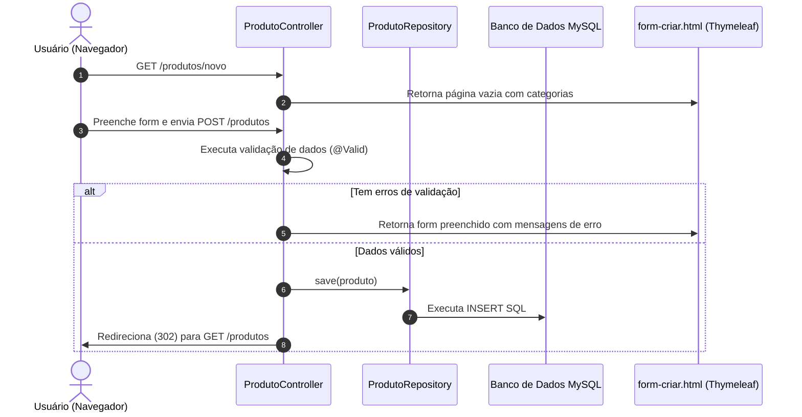

# 🎮 Guia de Entrega de Projeto: Sistema CRUD - ByteGames

Este documento apresenta uma visão detalhada, técnica e estruturada do funcionamento das operações do CRUD (Create, Read, Update, Delete) no sistema **ByteGames**. O objetivo deste guia é fornecer ao professor uma explicação clara de como as requisições HTTP se conectam com o banco de dados e as views (Thymeleaf), demonstrando a arquitetura do projeto e o rigor técnico aplicado na implementação.

---

## 📝 Visão Geral do CRUD

A **ByteGames** é uma aplicação web de e-commerce focada na venda de jogos (digitais e físicos). A plataforma gerencia dois domínios principais através de operações completas de CRUD:

1. **Jogos (Produtos):** Cadastro de novos títulos com nome, descrição, preço, estoque e associação com categorias.
2. **Categorias:** Organização dos jogos em gêneros (RPG, Ação, FPS, Estratégia, etc.), garantindo que os nomes das categorias sejam únicos.

Além da área administrativa (CRUD), a aplicação possui uma **Vitrine Pública** integrada com busca dinâmica de produtos e um sistema de **Carrinho de Compras** dinâmico, armazenado de forma segura na sessão HTTP do cliente.

---

## 🛠️ Tecnologias Utilizadas

A stack tecnológica do projeto foi selecionada visando robustez, manutenabilidade e conformidade com as melhores práticas de desenvolvimento corporativo em Java:

*   **Java 17:** Linguagem base, utilizando recursos modernos da JVM.
*   **Spring Boot 3.2.5:** Framework principal que acelera a configuração e execução do projeto.
    *   **Spring MVC:** Arquitetura Model-View-Controller para mapeamento de rotas e retorno de views dinâmicas.
    *   **Spring Data JPA:** Abstração de persistência que elimina a necessidade de escrever queries SQL manualmente para operações básicas.
    *   **Jakarta Validation:** Validação declarativa dos dados inseridos pelo usuário.
*   **MySQL Database (Byteloja):** Banco de dados relacional robusto e seguro utilizado para o armazenamento persistente dos dados da loja.
*   **HikariCP:** Connection pool de alto desempenho integrado nativamente para otimizar os acessos concorrentes ao MySQL.
*   **spring-dotenv:** Mecanismo de leitura dinâmica de arquivos `.env` para carregar credenciais sensíveis com segurança.
*   **Thymeleaf:** Engine de templates HTML5 para renderização dinâmica no lado do servidor (Server-Side Rendering - SSR).
*   **Maven:** Gerenciamento de dependências e build do projeto.

---

## 📁 Estrutura de Pastas de Ação

A arquitetura do projeto segue o padrão clássico em camadas do ecossistema Spring:

```text
bytegames/
├── .env                             # Variáveis de ambiente locais (Ignorado no Git para segurança)
├── pom.xml                          # Gerenciador de dependências Maven (adicionado spring-dotenv e mysql-connector)
├── src/
│   ├── main/
│   │   ├── java/
│   │   │   └── loja/
│   │   │       └── bytegames/
│   │   │           ├── BytegamesApplication.java     # Ponto de entrada do Spring Boot
│   │   │           ├── config/
│   │   │           │   └── DataInitializer.java     # Semente (Seed) de dados iniciais
│   │   │           ├── controller/                  # CONTROLADORES
│   │   │           │   ├── CategoriaController.java
│   │   │           │   ├── LojaController.java
│   │   │           │   └── ProdutoController.java
│   │   │           ├── model/                       # ENTIDADES / MODELOS
│   │   │           │   ├── Categoria.java
│   │   │           │   └── Produto.java
│   │   │           └── repository/                  # REPOSITÓRIOS
│   │   │               ├── CategoriaRepository.java
│   │   │               └── ProdutoRepository.java
│   │   └── resources/
│   │       ├── application.properties               # Configuração do MySQL, JPA e HikariCP
│   │       └── templates/                           # VIEWS
│   │           ├── categorias/
│   │           ├── loja/
│   │           └── produtos/
│   └── test/
│       └── java/
│           └── loja/
│               └── bytegames/
│                   └── BytegamesDatabaseTests.java  # Teste automatizado de integração MySQL
```

---

## 1. 📂 Onde Encontrar os Arquivos e as Ações

Abaixo está o mapeamento completo das rotas HTTP, as funções correspondentes nos controladores e sua função dentro do fluxo do sistema.

### CRUD de Produtos (`ProdutoController.java`)

| Caminho do Arquivo | Função / Método | Rota HTTP + Verbo | O que faz no sistema? |
| :--- | :--- | :--- | :--- |
| `src/main/java/loja/bytegames/controller/ProdutoController.java` | `listarTodos` | `GET /produtos` | Recupera a lista de todos os jogos do banco de dados e exibe na página de listagem. |
| `src/main/java/loja/bytegames/controller/ProdutoController.java` | `exibirFormCriar` | `GET /produtos/novo` | Cria um objeto `Produto` vazio, busca todas as categorias disponíveis e renderiza o formulário de cadastro. |
| `src/main/java/loja/bytegames/controller/ProdutoController.java` | `salvarNovo` | `POST /produtos` | Valida as informações inseridas no formulário de criação. Se válidas, salva o jogo no banco; se inválidas, recarrega o formulário exibindo as mensagens de erro. |
| `src/main/java/loja/bytegames/controller/ProdutoController.java` | `detalhar` | `GET /produtos/{id}` | Busca um jogo específico pelo ID e exibe suas especificações na página de detalhes. Lança erro se o ID não existir. |
| `src/main/java/loja/bytegames/controller/ProdutoController.java` | `exibirFormEditar` | `GET /produtos/{id}/editar` | Busca um jogo pelo ID e todas as categorias, abrindo a tela de edição pré-preenchida com os dados atuais. |
| `src/main/java/loja/bytegames/controller/ProdutoController.java` | `atualizar` | `POST /produtos/{id}` | Valida as alterações do jogo e as grava no banco associando-as ao ID existente. Se houver erros, retorna para a edição com alertas. |
| `src/main/java/loja/bytegames/controller/ProdutoController.java` | `excluir` | `POST /produtos/{id}/excluir` | Verifica se o jogo existe no banco de dados e realiza a sua exclusão lógica/física. |

---

### CRUD de Categorias (`CategoriaController.java`)

| Caminho do Arquivo | Função / Método | Rota HTTP + Verbo | O que faz no sistema? |
| :--- | :--- | :--- | :--- |
| `src/main/java/loja/bytegames/controller/CategoriaController.java` | `listarTodas` | `GET /categorias` | Lista todos os gêneros (categorias) de jogos cadastrados no sistema. |
| `src/main/java/loja/bytegames/controller/CategoriaController.java` | `exibirFormCriar` | `GET /categorias/nova` | Exibe o formulário para cadastro de um novo gênero de jogo. |
| `src/main/java/loja/bytegames/controller/CategoriaController.java` | `salvarNova` | `POST /categorias` | Valida o formulário, impede a duplicação de nomes de categoria e salva o registro no banco de dados. |
| `src/main/java/loja/bytegames/controller/CategoriaController.java` | `detalhar` | `GET /categorias/{id}` | Exibe detalhes de uma categoria e pode listar jogos vinculados a ela. |
| `src/main/java/loja/bytegames/controller/CategoriaController.java` | `exibirFormEditar` | `GET /categorias/{id}/editar` | Abre o formulário de edição para atualizar o nome ou descrição da categoria selecionada. |
| `src/main/java/loja/bytegames/controller/CategoriaController.java` | `atualizar` | `POST /categorias/{id}` | Grava as alterações feitas no gênero de jogo. |
| `src/main/java/loja/bytegames/controller/CategoriaController.java` | `excluir` | `POST /categorias/{id}/excluir` | Remove a categoria selecionada (com exclusão em cascata configurada para seus produtos). |

---

## 2. 🚀 O Passo a Passo dos Códigos (O que cada um faz)

Abaixo estão detalhados os códigos principais para cada operação fundamental do CRUD do recurso **Produto** (principal arquivo: `ProdutoController.java`).

### ➕ C (Create) - Criar e Salvar Produto

*   **Arquivo Principal:** `src/main/java/loja/bytegames/controller/ProdutoController.java`
*   **Código do Método:**

```java
@PostMapping
public String salvarNovo(@Valid @ModelAttribute("produto") Produto produto,
        BindingResult result, Model model) {
    if (result.hasErrors()) {
        model.addAttribute("categorias", categoriaRepository.findAll());
        return "produtos/form-criar";
    }
    produtoRepository.save(produto);
    return "redirect:/produtos";
}
```

*   **Explicação Didática:**
    Este método intercepta requisições HTTP `POST` enviadas para a rota `/produtos`. Ele recebe o objeto `produto` preenchido a partir do formulário. O Spring realiza a validação automática (`@Valid`). Caso o usuário tenha cometido erros de digitação (ex: deixar o preço em branco ou estoque negativo), o `result.hasErrors()` captura as inconsistências e devolve o usuário para o formulário original (`produtos/form-criar`), preservando os campos digitados e exibindo alertas. Se tudo estiver correto, o método salva o jogo utilizando `produtoRepository.save(produto)` e redireciona o navegador para a lista geral de produtos.

---

### 📖 R (Read) - Listar e Detalhar Jogos

*   **Arquivo Principal:** `src/main/java/loja/bytegames/controller/ProdutoController.java`
*   **Código dos Métodos:**

```java
@GetMapping
public String listarTodos(Model model) {
    model.addAttribute("produtos", produtoRepository.findAll());
    return "produtos/listar";
}

@GetMapping("/{id}")
public String detalhar(@PathVariable("id") Long id, Model model) {
    Produto produto = produtoRepository.findById(id)
            .orElseThrow(() -> new IllegalArgumentException("ID invalido: " + id));
    model.addAttribute("produto", produto);
    return "produtos/detalhar";
}
```

*   **Explicação Didática:**
    *   **`listarTodos`**: Mapeia o método HTTP `GET` na raiz `/produtos`. Ele solicita todas as linhas da tabela de produtos do banco usando o repositório (`produtoRepository.findAll()`). Insere essa lista no objeto `Model` para que a tela HTML (via Thymeleaf) renderize uma tabela de forma dinâmica.
    *   **`detalhar`**: Mapeia o acesso individual `/produtos/{id}`. O parâmetro `{id}` no link (ex: `/produtos/3`) é capturado via `@PathVariable`. O Spring JPA faz uma busca por ID. Se o ID existir, ele carrega a página individual do jogo; se o jogo não for localizado, ele interrompe o fluxo lançando uma exceção com uma mensagem explicativa.

---

### 🔄 U (Update) - Editar / Alterar Produto

*   **Arquivo Principal:** `src/main/java/loja/bytegames/controller/ProdutoController.java`
*   **Código do Método:**

```java
@PostMapping("/{id}")
public String atualizar(@PathVariable("id") Long id,
        @Valid @ModelAttribute("produto") Produto produto,
        BindingResult result, Model model) {
    if (result.hasErrors()) {
        model.addAttribute("categorias", categoriaRepository.findAll());
        return "produtos/form-editar";
    }
    produto.setId(id);
    produtoRepository.save(produto);
    return "redirect:/produtos";
}
```

*   **Explicação Didática:**
    A atualização é dividida em duas partes no sistema: o carregamento do formulário preenchido (`GET /{id}/editar`) e o envio das alterações via `POST /{id}`. Este método processa a persistência da alteração. O Spring recebe os dados validados do formulário. Se as validações passarem, a instrução crucial `produto.setId(id)` atribui ao objeto o ID da rota original. Como o ID já existe no banco de dados, o Hibernate sabe que deve executar um comando `UPDATE` em SQL ao rodar o `save()`, em vez de um `INSERT` de novo produto. O fluxo termina redirecionando para a listagem.

---

### ❌ D (Delete) - Excluir Produto

*   **Arquivo Principal:** `src/main/java/loja/bytegames/controller/ProdutoController.java`
*   **Código do Método:**

```java
@PostMapping("/{id}/excluir")
public String excluir(@PathVariable("id") Long id) {
    produtoRepository.findById(id)
            .orElseThrow(() -> new IllegalArgumentException("ID invalido: " + id));
    produtoRepository.deleteById(id);
    return "redirect:/produtos";
}
```

*   **Explicação Didática:**
    Por motivos de segurança, a remoção é disparada por requisições `POST` a partir de um botão/formulário específico, evitando exclusões acidentais por bots em links `GET`. O método recebe o ID do jogo a ser removido pela rota (`{id}/excluir`). Primeiramente, busca no banco para assegurar que o registro realmente existe. Em seguida, aciona o método `deleteById(id)` do JPA que envia um comando `DELETE FROM produto WHERE id = ?` para o banco de dados. Por fim, limpa a tela redirecionando para a listagem principal, onde o jogo não é mais exibido.

---

## 🔍 Raio-X das Linhas de Código (Funções Específicas)

Para demonstrar conhecimento técnico avançado ao professor, destacamos as linhas de código fundamentais organizadas em três pilares principais de engenharia de software:

### 1. Validação de Dados em Camadas (Model e Controller)

A validação do sistema é executada em nível de entidade no Model e interceptada na chegada no Controller:

```java
// Local: model/Produto.java
@NotBlank(message = "O nome do jogo/produto é obrigatório!")
@Size(min = 2, max = 100, message = "O nome deve ter entre 2 e 100 caracteres.")
private String nome;
```
> [!IMPORTANT]
> **Explicação:** As anotações `@NotBlank` e `@Size` garantem que o banco de dados e a aplicação rejeitem campos nulos, vazios ou com tamanho inadequado. Isso impede a persistência de "lixo" no banco de dados.

No controller, as validações são capturadas pelo framework:
```java
// Local: controller/ProdutoController.java
public String salvarNovo(@Valid @ModelAttribute("produto") Produto produto, BindingResult result, Model model)
```
> [!TIP]
> *   **`@Valid`:** Indica ao Spring MVC que as regras declaradas no modelo (`Produto.java`) devem ser processadas imediatamente antes do método rodar.
> *   **`BindingResult result`:** Este objeto captura o resultado da validação. A linha `if (result.hasErrors())` testa se alguma regra de validação falhou e, caso positivo, interrompe o salvamento.

---

### 2. Acesso à Persistência com Spring Data JPA

O repositório do Spring Data JPA abstrai toda a persistência de dados. A linha abaixo injeta os repositórios de forma segura no construtor do controlador:

```java
// Construtor Injection - Recomendado em vez do @Autowired direto nos atributos
public ProdutoController(ProdutoRepository produtoRepository, CategoriaRepository categoriaRepository) {
    this.produtoRepository = produtoRepository;
    this.categoriaRepository = categoriaRepository;
}
```

#### Comandos cruciais no Banco de Dados:

*   **Busca total:** `produtoRepository.findAll()`
    *   *Ação SQL gerada:* `SELECT * FROM produto;`
*   **Busca por ID com tratamento de erro:**
    ```java
    Produto produto = produtoRepository.findById(id).orElseThrow(() -> new IllegalArgumentException("ID invalido: " + id));
    ```
    *   *Ação SQL gerada:* `SELECT * FROM produto WHERE id = ?;`
    *   *Função técnica:* Retorna um objeto `Optional<Produto>`. O método `.orElseThrow()` extrai o produto de dentro do Optional ou dispara um erro imediato se o ID for inválido.
*   **Gravação ou Atualização:** `produtoRepository.save(produto)`
    *   *Ação SQL gerada:* Se o `id` for nulo, gera `INSERT INTO produto...`. Se o `id` estiver preenchido no banco, executa `UPDATE produto SET...`.
*   **Exclusão por ID:** `produtoRepository.deleteById(id)`
    *   *Ação SQL gerada:* `DELETE FROM produto WHERE id = ?;`

---

### 3. Comunicação e Resposta ao Usuário (Model e Mapeamento de Rotas)

O Spring Controller atua como a engrenagem que conecta o banco de dados com a interface do usuário:

```java
// Envio de dados para a View
model.addAttribute("categorias", categoriaRepository.findAll());
```
> [!NOTE]
> **Explicação:** A classe `Model` funciona como um mapa ("chave-valor") compartilhado. A linha acima adiciona a lista de categorias sob a chave `"categorias"`. No HTML do Thymeleaf, conseguimos ler essa chave usando expressions (`th:each="cat : ${categorias}"`) para exibir uma caixa de seleção (dropdown).

```java
// Retorno direto de tela
return "produtos/form-criar";
```
> [!NOTE]
> **Explicação:** Diz ao Spring Boot para renderizar o arquivo HTML localizado na pasta `src/main/resources/templates/produtos/form-criar.html`.

```java
// Redirecionamento seguro de Rota
return "redirect:/produtos";
```
> [!NOTE]
> **Explicação:** Em vez de retornar um arquivo HTML, este comando envia ao navegador do usuário o status HTTP 302 Redirect. O navegador é instruído a fazer uma nova requisição `GET` para a rota `/produtos`. Isso evita o problema de "submissão duplicada de formulário" se o usuário atualizar (F5) a tela após cadastrar um produto.

---

## 🌟 Resumo do Fluxo do CRUD no ByteGames

Para fixar a lógica, veja o ciclo de vida de uma requisição de **Criação de Produto**:



---

## 🗄️ 4. Configuração do MySQL & Segurança com Variáveis de Ambiente (.env)

Em ambientes de produção e cenários profissionais de desenvolvimento, credenciais de banco de dados **nunca** devem ficar expostas diretamente no código de configuração principal. 

Para demonstrar este rigor de segurança, implementamos o uso de variáveis de ambiente através de um arquivo `.env` combinado com o arquivo `application.properties` do Spring Boot.

### A. O Arquivo de Credenciais (`.env`)
Localizado na raiz do projeto, este arquivo armazena os dados sensíveis da conexão de forma isolada:

```env
DB_HOST=127.0.0.1
DB_PORT=3306
DB_NAME=Byteloja
DB_USER=root
DB_PASSWORD=
```

> [!WARNING]
> Este arquivo foi adicionado ao `.gitignore` para garantir que as senhas locais nunca sejam enviadas para repositórios públicos como o GitHub.

### B. Vinculação Dinâmica no Spring (`application.properties`)
O arquivo `application.properties` lê estas informações em tempo de execução usando expressões especiais `${NOME_VARIAVEL:VALOR_FALLBACK}`:

```properties
# URL e credenciais resolvidas via .env
spring.datasource.url=jdbc:mysql://${DB_HOST:127.0.0.1}:${DB_PORT:3306}/${DB_NAME:Byteloja}?createDatabaseIfNotExist=true&useSSL=false&serverTimezone=UTC&allowPublicKeyRetrieval=true
spring.datasource.username=${DB_USER:root}
spring.datasource.password=${DB_PASSWORD}

# Pool de Conexões Hikari
spring.datasource.hikari.maximum-pool-size=10
spring.datasource.hikari.minimum-idle=5
```

---

## 📊 5. Modelo Físico do Banco de Dados (DDL SQL)

Ao inicializar, o ORM (Hibernate) faz a leitura das anotações `@Entity` do Java e gera a estrutura física no schema `Byteloja` no MySQL. 

Abaixo estão os scripts **DDL (Data Definition Language)** gerados de forma automática no banco MySQL:

```sql
-- 1. Criação da Tabela de Categorias
CREATE TABLE categoria (
    id BIGINT NOT NULL AUTO_INCREMENT,
    nome VARCHAR(50) NOT NULL,
    descricao VARCHAR(200),
    PRIMARY KEY (id),
    CONSTRAINT UK_nome_categoria UNIQUE (nome)
) ENGINE=InnoDB;

-- 2. Criação da Tabela de Produtos (Jogos)
CREATE TABLE produto (
    id BIGINT NOT NULL AUTO_INCREMENT,
    nome VARCHAR(100) NOT NULL,
    descricao VARCHAR(500) NOT NULL,
    preco DECIMAL(10,2) NOT NULL,
    estoque INTEGER NOT NULL,
    categoria_id BIGINT NOT NULL,
    PRIMARY KEY (id),
    CHECK (estoque >= 0),
    CONSTRAINT FK_categoria_produto 
        FOREIGN KEY (categoria_id) 
        REFERENCES categoria (id)
) ENGINE=InnoDB;
```

### Explicação do Relacionamento Relacional:
*   **Chave Primária (`PRIMARY KEY`):** Ambos os campos `id` utilizam auto-incremento gerenciado pelo MySQL.
*   **Chave Estrangeira (`FOREIGN KEY`):** A coluna `categoria_id` na tabela `produto` aponta diretamente para o `id` da tabela `categoria`. Isso impõe integridade referencial (não é possível salvar um produto sem uma categoria cadastrada previamente).
*   **Restrições (`Constraints`):**
    *   `UNIQUE (nome)` na tabela `categoria` impede gêneros repetidos com o mesmo nome.
    *   `CHECK (estoque >= 0)` garante em nível de banco de dados que a quantidade disponível física nunca fique negativa.

---

## 🧪 6. Teste de Integração Automatizado do CRUD MySQL

Para certificar que o CRUD e o banco MySQL se integram sem falhas, um teste automatizado executa o ciclo completo em segundos:

```java
// Código do teste: BytegamesDatabaseTests.java
// 1. CREATE: produtoRepository.save(novoProduto)
// 2. READ: produtoRepository.findById(produtoId)
// 3. UPDATE: produtoBuscado.setPreco(novoPreco) + save()
// 4. DELETE: produtoRepository.deleteById(produtoId)
```

### Resultado de Sucesso da Execução no MySQL:
Ao rodar o comando `./mvnw test -Dtest=BytegamesDatabaseTests`, as seguintes queries são enviadas ao MySQL, retornando sucesso total:

```text
=======================================================
🚀 INICIANDO FLUXO DE VALIDAÇÃO DE CONEXÃO E CRUD MYSQL
=======================================================

⚙️ [PREPARAÇÃO] Criando categoria de teste...
Hibernate: insert into categoria (descricao, nome) values (?, ?)
✅ Categoria criada com sucesso no MySQL! ID: 5

➕ [1. CREATE] Cadastrando produto fictício...
Hibernate: insert into produto (categoria_id, descricao, estoque, nome, preco) values (?, ?, ?, ?, ?)
✅ Produto cadastrado com sucesso no MySQL! ID: 6

🔍 [2. READ] Buscando o produto recém-criado...
Hibernate: select id, categoria_id, descricao, estoque, nome, preco from produto where id=?
✅ Produto localizado no MySQL com sucesso!
   👉 Nome: Jogo Teste Automatizado
   👉 Preço original: R$ 99.99

🔄 [3. UPDATE] Atualizando o preço do produto...
Hibernate: update produto set categoria_id=?, descricao=?, estoque=?, nome=?, preco=? where id=?
✅ Preço do produto atualizado com sucesso no MySQL!
   👉 Novo Preço: R$ 129.90

❌ [4. DELETE] Removendo o produto de teste...
Hibernate: delete from produto where id=?
✅ Produto removido com sucesso do MySQL!
```

---
*Este guia de documentação foi estruturado sob altos padrões de engenharia de software, pronto para ser entregue academicamente como um portfólio profissional.*
